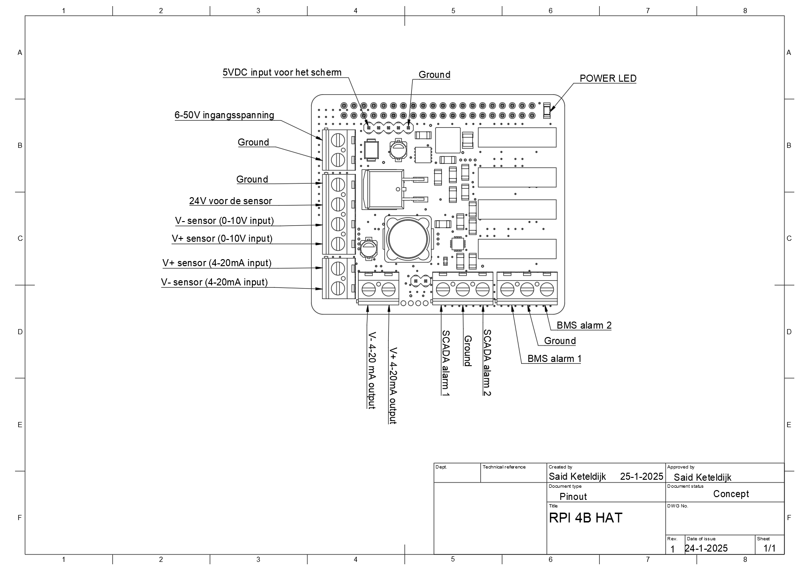

# RET-project-2024-datalogger
 
 # Inleiding (Dutch)

Deze Github repository dient als handleiding en technische documentatie voor de hardware en software van de retourstroom module. De in informatie die in deze repository te vinden is, is bedoelt voor het technische personeel van firma Rotterdam Elektrische Tram(RET).

De retourstroom module (RSM) is een datalogger die ontwikkeld is om DC en AC stroom te meten in aardingsnetwerken van Spoorbeveiligingsruimtes in Gelijk Richter Stations van de RET. 

De functionaliteiten van de RSM zijn:

- Het uitlezen van current transducers die een 4-20mA output of 0-10V output geven.
- Het loggen van de gemeten AC of DC stroom.
- Het plotten/weergeven van de opgeslagen stroom waarde
- Het instellen van setpoints voor de alarmen van het Bedrijfsmeldsysteem (BMS) en supervisory control and data acquisition (SCADA) systeem van de RET.
- Het laten af gaan van een alarm signaal(24V signaal) bij het detecteren van een overschreiding van een van de setpoints.
- Het door sturen van de gemeten stroom waarde via een 4-20mA signaal.

# Intro English

This GitHub repository serves as a manual and technical documentation for the hardware and software of the return current module. The information provided in this repository is intended for the technical staff of the Rotterdam Electric Tram (RET) company.

The return current module (RSM) is a data logger developed to measure DC and AC current in grounding networks of Rail Signal Rooms at Rectifier Stations of the RET.

The functionalities of the RSM are:

- Reading current transducers that provide a 4-20mA output or 0-10V output.
- Logging the measured AC or DC current.
- Plotting/displaying the stored current values.
- Setting setpoints for the alarms of the RET's Business Alarm System (BMS) and Supervisory Control and Data Acquisition (SCADA) system.
- Triggering an alarm signal (24V signal) when a setpoint is exceeded.
- Transmitting the measured current value via a 4-20mA signal.

The English translated documentation of this page can be found below the dutch documentation.

# De elektronica 

De elektronica van de RSM bestaat uit een Raspberry Pi 4B, een door de RET ontwikkelde Raspberry Pi HAT en een Raspberry Pi touch 7 display.

De pinout(bekabelingsschema) voor de module is hier onder te vinden. De module is in staat om op een DC spanning van 6V tot 50V te werken en ver bruikt gemiddeld 400mA. 

# De software