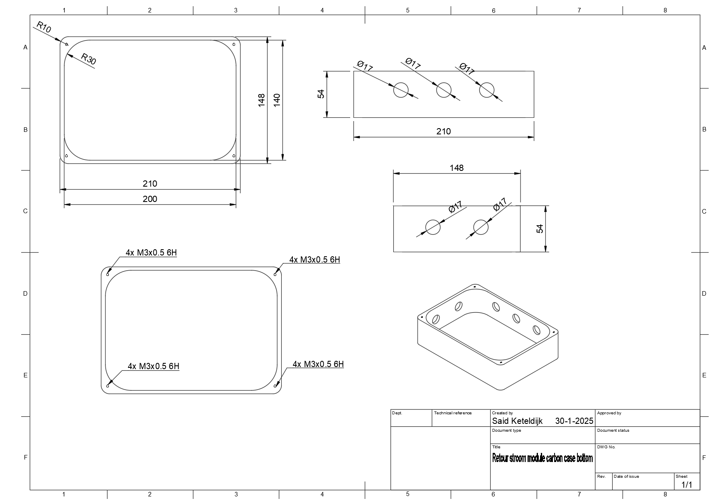

# RET-project-2024-datalogger
 
 # Inleiding (Dutch)

Deze Github repository dient als handleiding en technische documentatie voor de hardware en software van de retourstroom module. De in informatie die in deze repository te vinden is, is bedoelt voor het technische personeel van firma Rotterdam Elektrische Tram(RET).

De retourstroom module (RSM) is een datalogger die ontwikkeld is om DC en AC stroom te meten in aardingsnetwerken van Spoorbeveiligingsruimtes in Gelijk Richter Stations van de RET. 

De functionaliteiten van de RSM zijn:

- Het uitlezen van current transducers die een 4-20mA output of 0-10V output geven.
- Het loggen van de gemeten AC of DC stroom.
- Het plotten/weergeven van de opgeslagen stroom waarde
- Het instellen van setpoints voor de alarmen van het Bedrijfsmeldsysteem (BMS) en supervisory control and data acquisition (SCADA) systeem van de RET.
- Het laten af gaan van een alarm signaal(24V signaal) bij het detecteren van een overschreiding van een van de setpoints.
- Het door sturen van de gemeten stroom waarde via een 4-20mA signaal.


# Intro (English)

This GitHub repository serves as a manual and technical documentation for the hardware and software of the return current module. The information provided in this repository is intended for the technical staff of the Rotterdam Electric Tram (RET) company.

The return current module (RSM) is a data logger developed to measure DC and AC current in grounding networks of Rail Signal Rooms at Rectifier Stations of the RET.

The functionalities of the RSM are:

- Reading current transducers that provide a 4-20mA output or 0-10V output.
- Logging the measured AC or DC current.
- Plotting/displaying the stored current values.
- Setting setpoints for the alarms of the RET's Business Alarm System (BMS) and Supervisory Control and Data Acquisition (SCADA) system.
- Triggering an alarm signal (24V signal) when a setpoint is exceeded.
- Transmitting the measured current value via a 4-20mA signal.

The English translated documentation of this page can be found below the dutch documentation.


# De elektronica 

De elektronica van de RSM bestaat uit een Raspberry Pi 4B, een door de RET ontwikkelde Raspberry Pi HAT en een Raspberry Pi touch 7 display.


De pinout(bekabelingsschema) voor de module is hier onder te vinden. De module is in staat om op een DC spanning van 6V tot 50V te werken en ver bruikt gemiddeld 400mA. 


>Bekabelingsschema


>Behuizing bovenkant


>Behuizing onderkant

De Raspberry Pi HAT is opgebouwd uit de volgende units:
- Buckconverter om de ingangsspanning om te zetten naar een voedingsspanning van 5VDC.
- Een Boostconverter om de juiste spanning aan te bieden voor de alarmen voor het BMS en SCADA systeem.
- Een 4 kanaals relais unit om een hoog signaal (24V) of laag signaal(0V) door te geven aan het BMS of SCADA systeem.
- Een ADC module die een current transducer sensor kan uitlezen die een 4-20mA of 0-10V uitgangssignaal heeft.
- Een 4-20mA output loop generator


# De software

De software die op de Raspberry Pi 4B van de RSM draait is als volgt opgebouwd. Voor het besturingssysteem wordt er een Linux kernel gebruikt (Rasberry OS). 
Hierin wordt er een virtuele omgeving opgebouwd in python, in deze virtuele omgeving VENV (Virtual Environment) wordt de Python app opgestart die alle elektronica bestuurd en de grafische interface beheert.
De Python source code is te vinden in "RET-project-2024-datalogger > src > main.py".

Voor het starten van de Python app met VENV (Virtual Environment) zijn de volgende command's nodig. Deze commando's ingevuld te worden in de terminal van Linux:

- cd Desktop/App
- source myenv/bin/activate << start de VENV
- python3 systemtest.py  << start de App


# Software buggs 

Er staan nog een aantal bugs(software fouten die niet destructief zijn voor de melding van de gehele module ) in de Python code van de RSM module. 

De bugs zijn:

| Bug                           | Impact                       | Status        |
|-------------------------------|------------------------------|---------------|
| Updatefunctie Ampere verdwijnt       | Alleen UI-gerelateerd        | Closed          |
| Log.csv mist datum            | Minder gebruiksvriendelijk   | Open          |
| Geen 0-10V sensor support     | Functionaliteit beperkt      | Open          |
| Pyplot soms vertekend         | Visuele weergave             | Closed          |
| Setpoints niet persistent     | Verliest instellingen        | Open          |


# Installatie instructies

Om de RSM te installeren moeten de volgende stappen worden gevolgd:

1. Monteer Raspberry Pi 4B met de Raspberry Pi 7 inch display met 4 m3x10 schroeven.
2. Verbind de Raspberry Pi 4B met de Raspberry Pi 7 inch display met de 15cm 22pin ribbon kabel.
3. Klik de Raspberry pi HAT op de pin headers van de Raspberry Pi 4B, let er hierbij wel op dat de orientatie klop. De witte pijl van de HAT moet richting de achterkant wijzen dan de Raspberry Pi 4B, **NIET NAAR DE USB POORTEN!!**


4. Plaats de elektronica in de behuizing en verbind de externe kabels volgens het bekabelsing schema, let hierbij op de polariteiten en de spanningen.
5. Flash de SD-kaart met de benodigde software, deze software is te vinden in "RET-project-2024-datalogger > Linux Image >")
6. Steek de SD-kaart in de SD-kaart houder van de Raspberry Pi.
7. Verbind de Raspberry Pi volgens het verbindingsschema.
8. Verbind de Raspberry Pi nu met de 48V en kijk of hij opstart.
9. Sluit de Raspberry nu weer af (dit kan links boven in het menu of door de voeding uit te zetten).
10. Monteer de Raspberry Pi (met Raspberry Pi HAT en bekabelsing) in de behuizing


# Bestel proces 

Voor het bestellen van de printplaat (Raspberry Pi HAT) kan er gebruik gemaakt worden van het eurocircuits account van firma
OHM-installatie. De printplaat bestanden voor de bestelling zijn te vinden in "RET-project-2024-datalogger > Order files".

# Inloggegevens

Om in te loggen op de Raspberry zelf om de achterliggende code aan te passen kan er verbinding worden gemaakt met de Raspberry Pi via SSH, VNC of WinSCP. Het wachtwoord hier voor is te vinden bij de Energie voorziening van de RET (EV).

# Vorige printplaat versies

In de eerdere twee versies van de printplaaten zaten een aantal ontwerp/tekenfouten. De fouten die gevonden zijn:
- De 4-20mA output loop van versie 1 en 2 hebben een kortsluiting.
- De buckconverter van versie 1 heeft een kortsluiting.
- De compute module van versie 2 heeft een probleem met het opstarten, dit komt mogelijk door dat de ENABLE pin geen externe pulse van 1ms ontvangt bij het opstarten. Hier is een rtc met een externe voeding voor nodig.
- De pinout van de DSI connector van de is mogelijk incorrect omdat pin DSI1 is gebruikt in plaats van DSI0.

# Linux configuratie

Om bij het opstarten van de Raspberry Pi ook de VENV(Virtuele omgeving) en python app op te starten is er een app.service roetine
aangemaakt. Het .service bestand is te vinden in "/etc/systemd/system/app.service".


```console
[Unit]
Description=test app
After=graphical.target

[Service]
User=ret
Environment=DISPLAY=:0
Environment=XAUTHORITY=/home/ret/.Xauthority
Environment=XDG_RUNTIME_DIR=/run/user/1000
Environment=GDK_BACKEND=x11
Environment=QT_QPA_PLATFORM=xcb
ExecStart=/bin/bash /home/ret/Desktop/App/start_app.sh
Restart=always
RestartSec=10s
KillMode=process
TimeoutSec=infinity

[Install]
WantedBy=graphical.target
```
> app.service

In deze roetine wordt er wordt gewacht tot dat de grafische omgeving is opgestart. Zodra dit gebeurt is wordt het bestand "start_app.sh" bestand opgestart. In dit bestand staan de Linux commando's die nodig zijn om de VENV(virtuele omgeving) en de python app op te starten.

```
#!/bin/bash
cd /home/ret/Desktop/App
source myenv/bin/activate
python systemtest.py
```
> start_app.sh